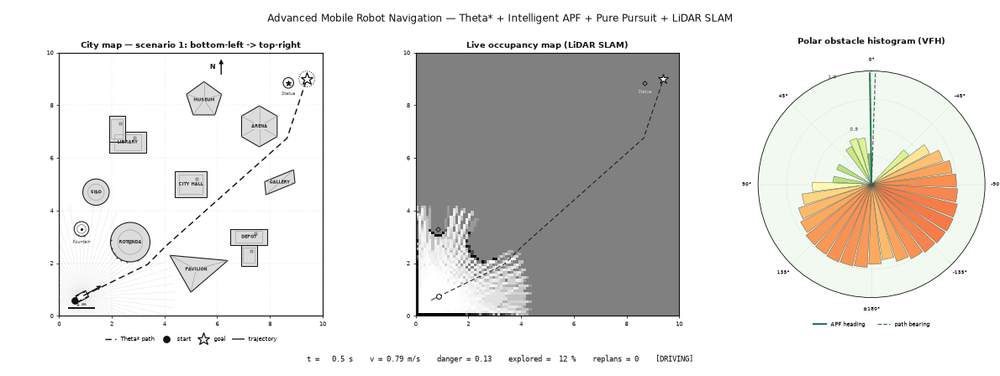
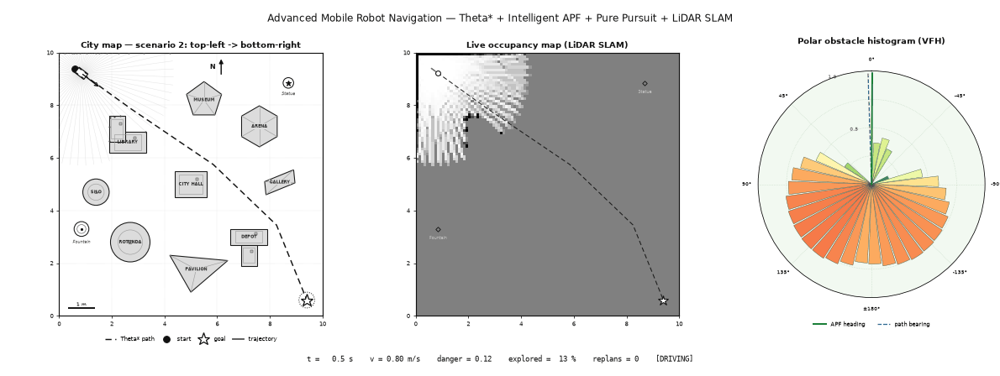
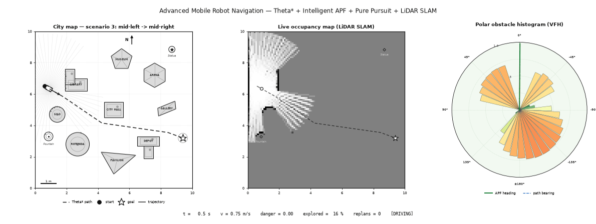
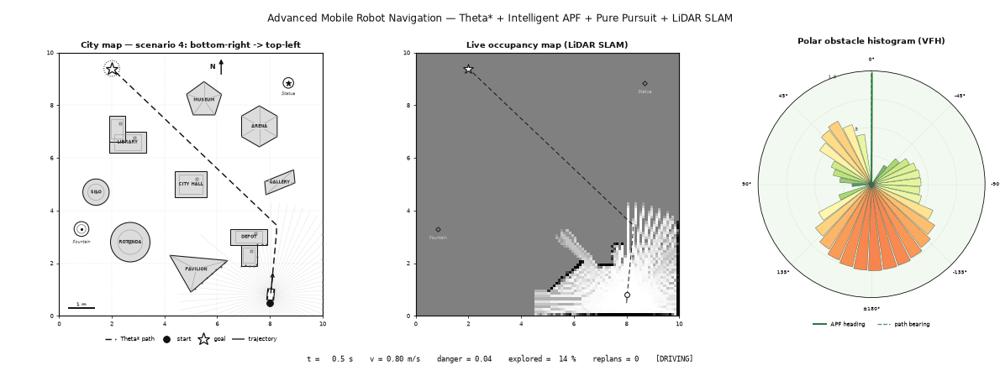

# AMRN — Advanced Mobile Robot Navigation

A complete 2D navigation stack for a car-like mobile robot in a 10×10 m
city map, visualized in a publication-style figure with **three live
panels** and a telemetry status bar below the maps.

> **Theta\*** global planning · **Intelligent APF** obstacle avoidance ·
> **Pure Pursuit** motion control · real-time **LiDAR** ·
> **occupancy-grid SLAM** · SLAM-aware **replanning** · **VFH polar
> histogram**



## The three panels

| Panel | Content | Style |
|---|---|---|
| **1 — City map** | Ground truth: buildings, landmarks, Theta\* path (dashed), LiDAR beams, APF force arrow, trajectory, car with steered front wheels | Monochrome, academic |
| **2 — Live occupancy map** | Built in real time from LiDAR only (log-odds SLAM): white = free, gray = unexplored, black = occupied; landmark beacons | Grayscale |
| **3 — Polar obstacle histogram (VFH)** | Current scan in the robot frame (0° = heading): bar height and color = obstacle closeness per bearing sector; solid green line = APF-chosen heading, dashed blue line = path bearing | Green → yellow → red danger scale |

The map contains varied building shapes — an **L-shaped** LIBRARY, a
**T-shaped** DEPOT, the CITY HALL **rectangle**, **round** ROTUNDA and
SILO, a **hexagonal** ARENA, a **pentagonal** MUSEUM, the PAVILION
**triangle** and the tilted GALLERY **slab** — plus two physical
landmarks (**Fountain**, **Statue**) that are planned around, sensed by
LiDAR and mapped by SLAM.

## Quick start

```bash
conda env create -f environment.yml   # creates conda env "AMRN"
conda activate AMRN
python main.py --scenario 1           # live animation window
```

## Command reference

| Command | Effect |
|---|---|
| `python main.py --scenario N` | Live animation, scenario `N` ∈ {1, 2, 3, 4} |
| `python main.py --scenario N --surprise` | Adds an obstacle **unknown to the planner**: LiDAR discovers it, SLAM flags the path, Theta\* replans live |
| `python main.py --save --scenario N` | Renders to `media/scenarioN.gif` (no window needed) |
| `python main.py --save --all` | Renders all four scenarios |
| `python main.py --save --fps 14 --dpi 70` | Video quality knobs (defaults shown) |
| `python verify.py` | Headless regression check: 8 runs, non-zero exit on failure |

With `ffmpeg` installed, `--save` also writes MP4 files automatically.

## Scenario videos

| # | Route | Video |
|---|---|---|
| 1 | (0.6, 0.6) → (9.4, 9.0) |  |
| 2 | (0.6, 9.4) → (9.4, 0.6) |  |
| 3 | (0.6, 6.5) → (9.4, 3.2) |  |
| 4 | (8.0, 0.5) → (2.0, 9.4) |  |

### Surprise obstacle → live replanning

The hatched obstacle sits on the planned path but is hidden from the
planner. LiDAR detects it, the SLAM map invalidates the route, and
Theta\* replans on the *sensed* map — the dashed path jumps to the new
route:


## How it works

Each control cycle (20 Hz):

1. **Sense** — the 72-beam, 3.5 m LiDAR scans the world (Gaussian range
   noise); the scan updates the log-odds occupancy grid and yields
   obstacle points.
2. **Supervise** — if the sensed map blocks the path ahead, the robot
   drifts > 1 m off it, or recovery repeats, Theta\* replans on
   `prior map ∪ SLAM map`.
3. **Guide** — Pure Pursuit picks a lookahead point on the densified
   (0.1 m) path with monotonic progress tracking.
4. **Avoid** — the Intelligent APF fuses lookahead attraction with
   repulsion + tangential escape forces from the live scan (averaged
   over points, capped, faded near the goal against GNRON) into a
   virtual target.
5. **Act** — Pure Pursuit steers the bicycle model toward the virtual
   target; speed adapts to steering, front clearance and goal distance;
   a blocked nose triggers reverse-and-swing recovery, and a hard
   safety layer prevents penetration.

## Verified results

`python verify.py` — all 8 runs pass:

| Run | Goal | Contacts | Min clearance | Travel ÷ path | Replans | Explored |
|---|---|---|---|---|---|---|
| Scenario 1 | reached | 0 | 0.32 m | 1.03 | 0 | 64 % |
| Scenario 2 | reached | 0 | 0.44 m | 1.01 | 0 | 67 % |
| Scenario 3 | reached | 0 | 0.45 m | 1.01 | 0 | 64 % |
| Scenario 4 | reached | 0 | 0.45 m | 1.02 | 0 | 67 % |
| Scenario 1 + surprise | reached | 0 | 0.35 m | 1.10 | 2 | 65 % |
| Scenario 2 + surprise | reached | 0 | 0.40 m | 1.03 | 1 | 67 % |
| Scenario 3 + surprise | reached | 0 | 0.40 m | 1.07 | 2 | 67 % |
| Scenario 4 + surprise | reached | 0 | 0.33 m | 1.07 | 1 | 67 % |

## Architecture

| Module | Responsibility |
|---|---|
| `amrn/world.py` | 10×10 world; rectangle / circle / convex-polygon obstacles with signed distance fields; cached SDF sphere-traced raycasting |
| `amrn/theta_star.py` | Any-angle Theta\* on an inflated occupancy grid; reusable `plan_on_grid` for SLAM replanning |
| `amrn/apf.py` | Intelligent APF: GNRON-safe repulsion, tangential escape, stuck detection, capped mean repulsion |
| `amrn/pure_pursuit.py` | Pure Pursuit with adaptive lookahead, path densification, monotonic progress, cross-track deviation |
| `amrn/lidar.py` | 360° LiDAR simulation with range noise |
| `amrn/slam.py` | Log-odds occupancy mapping; dilated planning-grid export |
| `amrn/robot.py` | Kinematic bicycle model with actuator lag; car drawing |
| `main.py` | Simulation loop, three-panel animation, video rendering, CLI |
| `verify.py` | Headless regression checks |

## Key parameters

| Parameter | Location | Default | Effect |
|---|---|---|---|
| `PLAN_INFLATE` | `main.py` | 0.3 m | Obstacle inflation for planning |
| `influence` | `amrn/apf.py` | 0.9 m | APF repulsion radius |
| `rep_cap` | `amrn/apf.py` | 2.2 | Max repulsion vs. attraction |
| `lookahead` | `amrn/pure_pursuit.py` | 0.55 m | Base pure-pursuit lookahead |
| `v_max` | `amrn/robot.py` | 0.8 m/s | Top speed |
| `n_beams`, `max_range` | `amrn/lidar.py` | 72, 3.5 m | LiDAR resolution / reach |
| `HIST_SECTORS` | `main.py` | 36 | Polar histogram sectors |
| `SCENARIOS` | `main.py` | 4 routes | Start/goal pairs |
